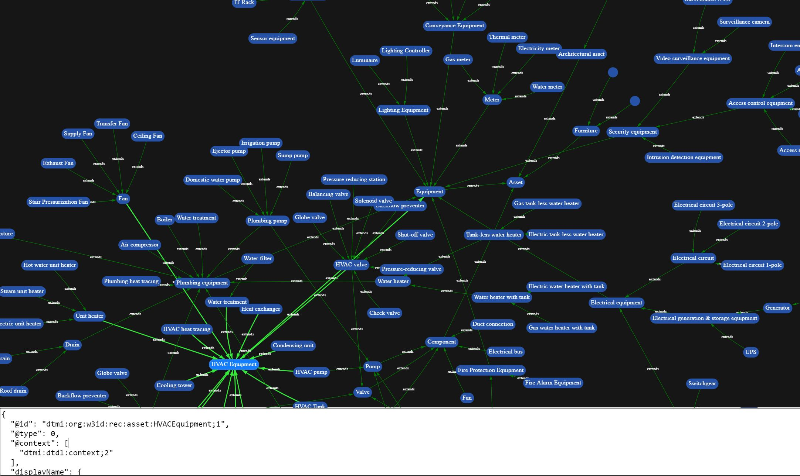

# ADT Model Visualizer

Azure Digital Twins (ADT) Model Visualizer is a .NET core web application that allows you to visually view your DTDL model(s) in ADT. 

It visually depicts:

- Interfaces
- Interfaces that extend other Interfaces
- Relationships between Interfaces

You can also click on the Interface icons to view the Interface's DTDL.



## Prerequisites


- Create an Azure Digital Twins service instance according to the article [https://docs.microsoft.com/en-us/azure/digital-twins/how-to-set-up-instance-portal](https://docs.microsoft.com/en-us/azure/digital-twins/how-to-set-up-instance-portal).
You have two options to setup authentication in the web app:
  - Setup an Azure Active Directory client app registration according to this article [https://docs.microsoft.com/en-us/azure/digital-twins/how-to-create-app-registration](https://docs.microsoft.com/en-us/azure/digital-twins/how-to-create-app-registration).  A few important aspects for your app registrations:
    - Make sure you add app registrations to the Web platform section of the app registration, not the desktop/mobile section.
    - When adding callback URLs to the app registration, please make sure to add `https://localhost:5001`.
    - Check the **Access Tokens** toggle in the **Implicit Grants** section a few paragraphs below the **Platform Configuration** section on the page. If this toggle is not checked, you will not get authorization tokens.
  - Leverage Managed Identity credential which allows you to use Visual Studio or Visual Studo Code to authenticate your calls. In this case, make sure your developer account has been added the role of 'Azure Digital Twins Data Owner' in your Azure Digital Twins instance. Learn more about here [https://docs.microsoft.com/en-us/azure/digital-twins/how-to-authenticate-client](https://docs.microsoft.com/en-us/azure/digital-twins/how-to-authenticate-client).
- Upload your DTDL model to your ADT instance using the [ADT CLI](https://docs.microsoft.com/en-us/cli/azure/ext/azure-iot/dt/model?view=azure-cli-latest#ext_azure_iot_az_dt_model_create), [REST API](https://docs.microsoft.com/en-us/rest/api/digital-twins/dataplane/models), or [SDKs](https://docs.microsoft.com/en-us/azure/digital-twins/how-to-manage-model#upload-models).

## Run ADT Model Visualizer locally

- Clone the repo
- In the ```ADTModelVisualizer``` folder, edit the ```appsettings.Development.json``` file to match your ADT instance and Azure Active Directory client app registration settings:
```
  "TenantId": "11111111-1111-1111-1111-111111111111",
  "ClientId": "22222222-2222-2222-2222-222222222222",
  "ClientSecret": "<your client secret>",
  "AdtApiUrl": "https://youradt.api.wus2.digitaltwins.azure.net",
  "UseMsiCredential": false
```
- Alternatively if you are using Managed Identity Credential option edit the ```appsettings.Development.json``` file to match your ADT instance and set the `UseMsiCredential` to `true`:
```
  "AdtApiUrl": "https://youradt.api.wus2.digitaltwins.azure.net",
  "UseMsiCredential": true
```
- Build and run the application:
  - ```dotnet build```
  - ```dotnet run```
- Browse to [https://localhost:5001](https://localhost:5001)

## Credit
The ADT Model Visualizer was developed in collaboration with [Willow](https://www.willowinc.com/).
