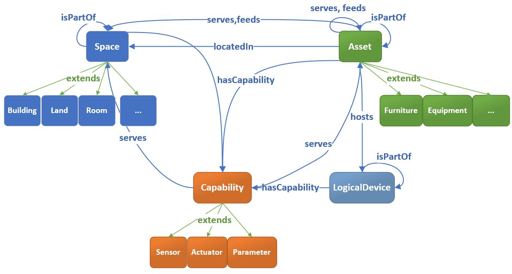
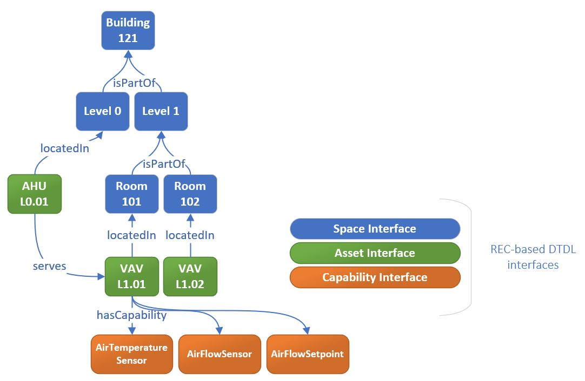
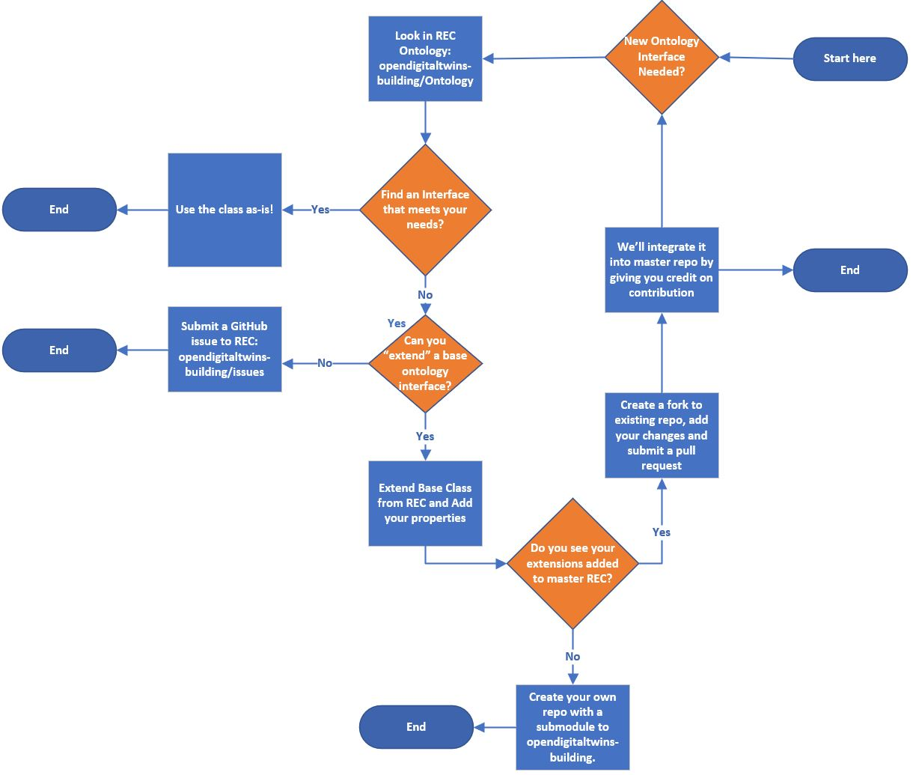

# Digital Twins Definition Language-based [RealEstateCore](https://doc.realestatecore.io/3.3/full.html) ontology for smart buildings


## Motivation and purpose

[Azure Digital Twins (ADT)](https://azure.microsoft.com/en-us/services/digital-twins/), and its underlying [Digital Twins Definition Language (DTDL)](https://github.com/Azure/opendigitaltwins-dtdl), are at the heart of Smart Building solutions built on Azure.

DTDL is the language by which developers can define the language of the entities they expect to use in their topologies. Since DTDL is a blank canvas which can model any entity, it is important to accelerate developers' time to results by providing a common domain-specific ontology to bootstrap solution building, as well as seamless integration between DTDL-based solutions from different vendors.

Our partnership with the [RealEstateCore](https://www.realestatecore.io/) Consortium has delivered this DTDL-based ontology (or set of models) for the real estate industry, which provides common ground for modeling smart buildings while leveraging industry standards to prevent reinvention. As part of the delivery, we also provide best practices for how to consume and properly extend the ontology.

This is an open-source ontology definition which learns from, builds on, and uses industry standards, and meets the needs of solution builders in the built world. We hope it will be widely adopted and/or extended by developers, and strongly encourage active participation and contribution.

## DTDL-based RealEstateCore ontology overview

This DTDL ontology is implemented based on the domain ontology [RealEstateCore](https://w3id.org/rec/full/).  RealEstateCore is a common language used to model and control buildings, simplifying the development of new services. The ontology is rich and complete, while providing simplicity and real-world applicability with proven industry solutions and partnerships. It has seen practical deployments across sizeable real estate portfolios over the past several years, and has gone through several revisions based on real-world feedback and learning. RealEstateCore specifically does not aim to be a new standard, but rather provides a common denominator and bridge with other building industry standards such as Brick Schema, Project Haystack, W3C Building Topology Ontology (W3C BOT), and more. Read more about our ontology [alignment with standards](#alignment-with-standards).

The original RealEstateCore ontology is represented using the W3C Web Ontology Language (OWL). It has been converted into the DTDL syntax used in this repository using our universal [OWL2DTDL](OWL2DTDL/README.md) tool.

## RealEstateCore structure



RealEstateCore ontology consists of a main set of interfaces:
  * **Asset** – An object which is placed inside of a building, but is not an integral part of that building's structure, for example architectural, furniture, equipment, systems, etc.
  * **LogicalDevice** – A physical or logical object defined as an electronic equipment or software that communicates and interacts with a digital twin platform. A logical device could be an integrated circuit inside of a smart HVAC unit, or a virtual server running on a Kubernetes cluster. Logical devices can have Capability instances (through hasCapability) that describe their input/output capabilities. If Logical Devices are embedded within Asset entities (through the hostedBy property) such capabilities typically denote the capabilities of the asset.
  * **Capability** - A capability indicates the capacity of a entity, be it a Space, an Asset, or a LogicalDevice, to produce or ingest data. This is equivalent to the term \"point\" in Brick Schema and generic Building Management System. Specific subclasses specialize this behavior: Sensor entities harvest data from the real world, Actuator entities accept commands from a digital twin platform, and Parameter entities configure some capability or system.
  * **Space** - A contiguous part of the physical world that has a 3D spatial extent and that contains or can contain sub-spaces. For example a Region can contain many pieces of Land, which in turn can contain many Buildings, which in turn can contain Levels and Rooms.

RealEstateCore also contains additional base interfaces:
  * **Agent** - Any basic types of stakeholder that can have roles or perform activities, e.g., people, companies, departments.
  * **Building Component** - A part that constitutes a piece of a building's structural makeup, for example Facade, Wall, Slab, RoofInner, etc.
  * **Collection** - An administrative grouping of entities that are addressed and treated as a unit for some purpose. These entities may have some spatial arrangement (e.g., an Apartment is typically contiguous), however that is not a requirement (see, e.g., a distributed Campus consisting of spatially disjoint plots or buildings).
  * **Document** - A formal piece of written, printed or electronic matter that provides information or evidence or that serves as an official record, for example LeaseContract, Building Specification, Warranty, Drawing, etc. 
  * **Event** - A spatiotemporally indexed entity with participants, something which occurs somewhere, and that has or takes some time, for example a Lease or Rent.
  * **Role** - A role that is held by some agent, for example a person could hold a Sales Representative role, or an organization could hold a Maintenance Responsibility role

RealEstateCore contains a number of relationship types, here we list the main ones:
* **isPartOf**, **hasPart** - A simplified set of topological relations to connect sub- and super-entities within the top-level RealEstateCore interface tree. "isPartOf" and "hasPart" are now defined to operate on entities of the same type, for example Spaces have only Spaces as parts, Assets have only Assets as parts, etc.
* **hasCapability** - Indicates that a Space, Asset or LogicalDevice has the ability to produces or ingest data represented by sensors, actuators or parameters, for example a VAV.L01.01 *hasCapability* relationship to an TemperatureSensor. Inverse of **isCapabilityOf**.
* **includedIn** -  Indicates that an entity is included in some Collection, for example a Building is included in a RealEstate, or a Room is included in an Apartment. Inverse of **includes**, for example a Campus includes some Space, an Apartment includes some Room
* **locatedIn** - Indicates that a given Asset is physically located in a Space. There is no inverse of this one.
* **hosts** - Indicates that a given Asset hosts a logical device; for example a Raspberry Pi *hosts* a Home Assistant installation, or an IoT-connect smart camera unit *hosts* an IoT Edge runtime. Inverse of: **hostedBy**, which indicates the physical hardware asset that a given logical device is hosted and executed on.
* **serves** - The coverage or impact area of a given Asset or Sensor/Actuator. For example: an air-treatment unit might serve several Rooms or a full Building. Note that Assets can also service one another, for example an air-treatment Asset might serve an air diffuser Asset. Inverse of: **servedBy**
* **feeds** - Indicates that a given equipment is feeding "something" to another equipment or space, like electricity, water or air. For example, an AHU equipment *feeds* air to a VAV equipment. See [Equipment](Ontology/Asset/Equipment/Equipment.json) interface for  details. Inverse of: **isFedBy**
* **hasBuildingComponent** - Parthood traversal property linking Buildings to the Building Components that they are made up of, for example a Building *hasBuildingComponent* a Facade or Wall which are of type *BuildingComponent*,. Inverse of: **componentOfBuilding**.
* **owns** - Indicates that an agent is the legal owner of a given entity, for example a Company owns some Real Estate. Inverse of: **ownedBy**

## Using RealEstateCore ontology

Here is a real example of a subgraph of an Azure Digital Twins instance based on this ontology:



We have instantiated the following twins:
* A building instance *Building 121* of type [**dtmi:digitaltwins:rec_3_3:core:Building;1**](Ontology/Space/Building.json) inherited from [**dtmi:digitaltwins:rec_3_3:core:Space;1**](Ontology/Space.json)
* One level instance *Level 1* of type [**dtmi:digitaltwins:rec_3_3:core:Level;1**](Ontology/Space/Level.json) which is part of the building, inherited from same Space above.
* An *HVAC Zone 1* of type [**dtmi:digitaltwins:rec_3_3:core:HVACZone;1**](Ontology/Space/Zone/HVACZone.json), inherited from same Space above.
* Three room instances *Room 101*, *Room 102* and *Room 103* of type [**dtmi:digitaltwins:rec_3_3:building:ClimateControlRoom;1**](Ontology/Space/Room/UtilitiesRoom/ClimateControlRoom.json) which are part of level and *Room 103* is also part of *HVAC Zone 1*, inherited from same Space above.
* Three VAV physical devices *VAVL1.01*, *VAVL1.02*, *VAVL1.03* of type [**dtmi:digitaltwins:rec_3_3:asset:VAVBox;1**](Ontology/Asset/Equipment/HVACEquipment/TerminalUnit/VAVBox.json) with three capabilities *AirTemperatureSensor*, *AirFlowSensor* and *AirFlowSetpoint*, one serves HVAC zone and all located in rooms. VAV devices inherit from [**dtmi:digitaltwins:rec_3_3:core:Asset;1**](Ontology/Asset.json)
* An AHU physical device *AHUL1.01* of type [**dtmi:digitaltwins:rec_3_3:asset:AirHandlingUnit;1**](Ontology/Asset/Equipment/HVACEquipment/AirHandlingUnit.json) which feeds one of the VAV and is located in a room. AHU device inherits from same Asset above.
* Few capabilities instances of type [**dtmi:digitaltwins:rec_3_3:core:TemperatureSensor;1**](Ontology/Capability/Sensor/TemperatureSensor.json), of type [**dtmi:digitaltwins:rec_3_3:core:AirFlowSensor;1**](Ontology/Capability/Sensor/FlowSensor/AirFlowSensor.json) and of type [**dtmi:digitaltwins:rec_3_3:core:FlowSetpoint;1**](Ontology/Capability/Parameter/Setpoint/FlowSensor/FlowSetpoint.json), all inherited from [**dtmi:digitaltwins:rec_3_3:core:Capability;1**](Ontology/Capability.json). These are assigned using *hasCapability* relationship to VAVs. 
* One capability instance *TemperatureR* of type [**dtmi:digitaltwins:rec_3_3:core:TemperatureSensor;1**](Ontology/Capability/Sensor/TemperatureSensor.json) assigned to one of the rooms to show temperature on room level.

Below is the Azure Digital Twins query to find out all rooms' temperatures in *Building 121*, *Level 1* which values are below 73. 
```sql
SELECT Room, Sensor, Level 
    FROM DIGITALTWINS Room  
    JOIN Level RELATED Room.isPartOf
    JOIN Sensor RELATED Room.hasCapability
    JOIN Building RELATED Level.isPartOf
    WHERE IS_OF_MODEL(Room, 'dtmi:digitaltwins:rec_3_3:core:Room;1') 
    AND IS_OF_MODEL(Level, 'dtmi:digitaltwins:rec_3_3:core:Level;1')
    AND IS_OF_MODEL(Building, 'dtmi:digitaltwins:rec_3_3:core:Building;1')
    AND IS_OF_MODEL(Sensor, 'dtmi:digitaltwins:rec_3_3:core:TemperatureSensor;1')
    AND Level.levelNumber = 1 
    AND IS_DEFINED(Sensor.hasValue)
    AND Building.$dtId = 'Building121'
    AND Sensor.hasValue < 73
```

Another query example on above subgraph is to find the rooms which are affected by VAVs with serialNumber 2561A5510 (because it's going to be replaced).
```sql
SELECT VAV, Room 
    FROM DIGITALTWINS VAV
    JOIN Room RELATED VAV.locatedIn  
    JOIN Level RELATED Room.isPartOf
    JOIN Building RELATED Level.isPartOf
    WHERE IS_OF_MODEL(Room, 'dtmi:digitaltwins:rec_3_3:core:Room;1') 
    AND IS_OF_MODEL(Level, 'dtmi:digitaltwins:rec_3_3:core:Level;1')
    AND IS_OF_MODEL(Building, 'dtmi:digitaltwins:rec_3_3:core:Building;1')
    AND Building.$dtId = 'Building121'
    AND VAV.serialNumber ='2561A5510'
```
To learn more on Azure Digital Twins queries, please refer to [Query the Azure Digital Twins twin graph](https://docs.microsoft.com/azure/digital-twins/how-to-query-graph) article.

## Upload the models to Azure Digital Twins
You can upload this ontology into your own instance of ADT by using [Model Uploader](ModelUploader). Follow the instructions on ModelUploader to upload all of these models into your own instance. Here is [an article](https://docs.microsoft.com/en-us/azure/digital-twins/how-to-manage-model) on how to manage models, update, retrieve, update, decommission and delete models.

## Visualizing the models
Once you have uploaded these models into your Azure Digital Twins instance, you can view the ontology using [ADT Model Visualizer](AdtModelVisualizer). This tool is a draft version (read-only visualizer, no edits) and we invite you to contribute to it to make it better.

## Validating the models
The DTDL RealEstateCore models in this repo have already been validated. You don't have to validate them with the DTDL parser unless you change them. If you have extended the models or made changes, it's recommended to validate the models as described by this article: [Validate models](https://docs.microsoft.com/en-us/azure/digital-twins/concepts-convert-models#validate-and-upload-dtdl-models).

## Extending the ontology
This is the decision tree workflow we recommend for extending and contributing to this DTDL-based RealEstateCore ontology.

  

We encourage users to extend existing models via inheritance by using the DTDL **extends** property. Interface inheritance can be used to create specialized interfaces from more general interfaces. If you need to add a new interface or add additional properties, try to find the interfaces to extend from. For example, if you need to add a specialized type of room, like *FocusRoom*, add a new interface *FocusRoom* which inherits from *Room* interface. Through inheritance, the *FocusRoom* has two properties *Room*: the *personCapacity* property (from Room) and the *occupied* property (from FocusRoom).

```yaml
[
  {
    "@id": "dtmi:digitaltwins:rec_3_3:core:Room;1",
    "@type": "Interface",
    "dtmi:dtdl:property:contents;2": {
      "@type": "Property",
      // ...
      "name": "personCapacity",
      "schema": "integer"
    },
    // ...
    "extends": "dtmi:digitaltwins:rec_3_3:core:Space;1",
    "@context": "dtmi:dtdl:context;2"
  },
  {
    "@id": "dtmi:digitaltwins:rec_3_3:core:FocusRoom;1",
    "@type": "Interface",
    "dtmi:dtdl:property:contents;2": {
      "@type": "Property",
      // ...
      "name": "occupied",
      "schema": "bool"
    },
    // ...
    "extends": "dtmi:digitaltwins:rec_3_3:core:Room;1",
    "@context": "dtmi:dtdl:context;2"
  }
]
```

Now that you have extended your specialized interface(s), ask yourself if your extensions are generic and could benefit other users. If the answer is yes, our recommendation is to fork the existing repository, make your changes and send a pull request (see the section below).

## Contributing to ontology
We are working on improving the main interfaces, adding more interfaces in areas that we don't yet support, as well as making better tools to integrate and use the models in smart building platforms and its applications.

We encourage you to contribute to continue improving the DTDL-based RealEstateCore ontology. Please point out bugs or peculiarities, add or extend interfaces and vocabularies, and suggest improvements to evolve this ontology.

* Comment or create a new issue for bug reporting
* For improvements, please fork this repository, make your changes and send a pull request

Pull requests will be evaluated based on the quality of the proposed interface models, adherence to the modeling conventions used in the repo (see below), and conceptual and roadmap compliance with the [RealEstateCore OWL model project](https://github.com/RealEstateCore/rec/) that DTDL RealEstateCore is generated from.

### Modeling conventions

* All entity naming (Interfaces, Properties, Relationships, Components, etc.) is done in English. 
* Interfaces are named as singular nouns using CamelCase with capital initial (aka. PascalCase); e.g., `Space` or `Asset`. For the sake of clarity, sub-interfaces can include suffixes indicating parent interfaces, e.g., `LightingEquipment` or `SpaceCollection`.
* Properties are named as singular nouns using camelCase with lower-case initial, typically with two or three name components; e.g., `filterType`, `maxVerticalRise`. Exceptions to the singular noun rule may be made in cases where the property represents a count (e.g., `maxLandings` for an `Elevator` interface).
* Relationships are named as singular nouns using camelCase with lower-case initial, typically with two or three name components. Naming can represent either the relationship itself, in the case of generic relationships (e.g., `isPartOf` or `serves`), or a target Interface (e.g., `hasCapability` or `subMeterOf`).
* Please use language-tagged `displayName`and `description` fields, providing at minimum English-language versions of these (more languages are of course welcome!).
* The English-language value of `displayName` should mirror the DTMI local name written out in lowercase, i.e., `isPartOf` has the display name `is part of`.

## Alignment with standards 

* **Asset** interfaces, covering systems and equipment within buildings is based on an interpretation and extension of the [Brick Schema Ontology](https://brickschema.org/ontology/), carried out in conjunction with [Willow Inc](https://www.willowinc.com/willowtwin/). 
*  Our spatial modeling is in line with the [W3C BOT ontology](https://w3c-lbd-cg.github.io/bot) and clearly differentiates between **Building Components** and **Spaces**; where the former make up the building's structural elements, and the latter make up physical spaces inside (rooms, levels, etc) or outside (regions, land, etc) of a building.
*  **Capability** interfaces are based on the Building Management System (BMS) notion of Points (as represented in Brick Schema or Haystack). Subclasses of Capability denote specific sensorsing or actuation capabilities that can be assigned to Spaces, Assets, etc.
* **LogicalDevice** is inspired by [Azure IoT Hub](https://docs.microsoft.com/en-us/azure/iot-hub/about-iot-hub)'s *Device* terminology and represents a connected entity that pushes data to the cloud or receives commands from the cloud (typically an endpoint such as a piece of software like an IoTEdge module, a HomeAssistant install, or some proprietary BMS system, etc.). The reason we have created the *LogicalDevice* interface different from the *Device* interface, is that we see the physical device being represented as a *Device* digital twin in IoT Hub and the *LogicalDevice* twin being represented in this ontology. For example, the *LogicalDevice* may have *hasCapability* relationships to *Capability*. A physical device connected to IoT Hub would not have those relationships, instead it would have *Telemetry*, *Properties*, and *Commands* potentially feeding the Sensors, Parameters, and Actuators in this ontology.

The DTDL-based RealEstateCore ontology accelerates developers from the “blank page” and facilitates business-to-business integrations between vendors in a smart building. Since the DTDL-based ontology is open sourced, developers can easily annotate existing models while contributing their own domain expertise. Read more about:
* [Idun ProptechOS and RealEstateCore](Partners/README.md#idun-realestatecore)
* [Willow](Partners/README.md#willow-inc)

## More about Azure Digital Twins

* [Azure Digital Twins product page](https://azure.microsoft.com/en-us/services/digital-twins/)
* [Azure Digital Twins: Powering the next generation of IoT connected solutions](https://channel9.msdn.com/Events/Build/2020/INT177)
* [Digital Twins Definition Language Repository](https://github.com/Azure/opendigitaltwins-dtdl)
* [Azure Digital Twins introduction video](https://azure.microsoft.com/en-us/resources/videos/azure-digital-twins-introduction-video/)
* [Azure Digital Twins IoT Show Public Preview](https://www.youtube.com/watch?v=D6kyhrRVdfc&feature=youtu.be)
* [Azure Digital Twins Tech Deep Dive](https://www.youtube.com/watch?v=5Ku55g1GQG8&feature=youtu.be)
* [ADT Explorer](https://github.com/Azure-Samples/digital-twins-explorer)


This project has adopted the [Microsoft Open Source Code of Conduct](https://opensource.microsoft.com/codeofconduct/).
For more information see the [Code of Conduct FAQ](https://opensource.microsoft.com/codeofconduct/faq/) or contact [opencode@microsoft.com](mailto:opencode@microsoft.com) with any additional questions or comments.

Microsoft collects performance and usage information which may be used to provide and improve Microsoft products and services and enhance your experience.
To learn more, review the [privacy statement](https://go.microsoft.com/fwlink/?LinkId=521839&clcid=0x409).

## Contributors
<sub>
Jönköping University: Karl Hammar
<br /> 
Microsoft: Alina Stanciu, Brian Crawford, Bert Van Hoof, Akshay Johar, Matthew Vogel, Kevin Hilscher, Miriam Berhane Russom, OP Ravi
<br /> 
RealEstateCore Consortium: Karl Hammar, Erik Wallin, Per Karlberg, Peter Hartlev, Joakim Eriksson
<br />
Idun Real Estate Solutions: Erik Wallin, Per Karlberg
<br />
Willow: Rick Szcodronski
</sub>


