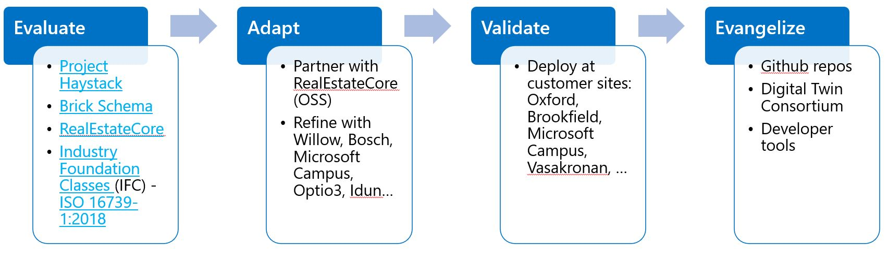

# [RealEstateCore(REC)](https://www.realestatecore.io/)-based Building Ontology for smart building solutions built on [Azure Digital Twins](https://azure.microsoft.com/en-us/services/digital-twins/)

## Motivation & Purpose

Although [Digital Twins Definition Language (DTDL)](https://github.com/Azure/opendigitaltwins-dtdl) provides the schema by which developers can define the models of the entities they expect to use in their topologies, we are faced with problems such as developers not knowing where to start or creating models so fragmented that make it impossible to integrate with other DTDL-based solutions.

Our motivation is to provide an open-source DTDL building ontology definition which learns from, builds on, and/or uses industry standards, meets the needs of downstream developers, and will be widely adopted and/or extended by the industry.

<*explain why this is the recommeded building ontology for smart building solutions built with Azure Digital Twins*>

## Why RealEstateCore ontology

We selected RealEstateCore ontology foundation over other candidates for several reasons:
  * Deep domain knowledge and expertise with industry (smart buildings, real estate) and technology (Semantic Web).
  * Commitment to openness and knowledge-sharing (freely accessible for commercial use under the MIT License).
  * Incorporation of other industry concepts and standards (BIM, IFC, Brick, Haystack, etc.).
  * Delivers a generic OWL to DTDL converter which could be used to convert other OWL-based standards into DTDL.
  * Years of experience with model authoring and maintenance.
  * Real-world applications and partners actively using their models (Vasakronan, Idun, etc.).
  * Familiarity with and commitment to Azure, Azure IoT, and Digital Twins.

## Ontology Structure

RealEstateCore consists of a set of modules, which in the current version include:
  * **Agent** - Basic types of agents (people, organizations, groups), structurally aligned with FOAF.
  * **Asset** – A real-world object, which is tangible like architectural component, furniture, workstation, all kinds of equipment HVAC, plumbing, electrical, lighting, etc. Equipment is a type of asset could be anything from a tool, device, kit, apparatus, etc. which has a maker, a model, installation date, etc. Example of equipment could be from multiple domains, electrical, lighting, plumbing, but also HVAC, metering, elevator, etc. See also Brick definition for equipment 
  * **Device** – Devices are things which are capable of communication, telemetry, events or commands which are connected to a cloud service like IoT Hub.
  * **Capability** - It provides functionality in support of a device such as a sensor, setpoint, status, or command. Capabilities are connected to device but not assets. 
  * **Space** - thing which support location positioning (indoor or outdoor) or geographical region, like Building, Land, Region, Level, Room, Zone, etc.
  * **Lease** - covers leases, leased, lease contracts, premise types, etc.

## Using REC

Lorem ipsum dolor sit amet, consectetur adipiscing elit.

## Extending REC

Lorem ipsum dolor sit amet, consectetur adipiscing elit.

## Contributing to REC

Lorem ipsum dolor sit amet, consectetur adipiscing elit.

## Using Models in a Solution

Lorem ipsum dolor sit amet, consectetur adipiscing elit.
